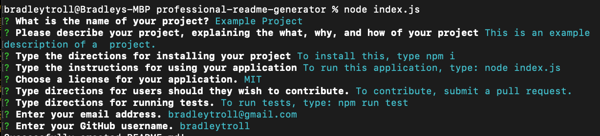
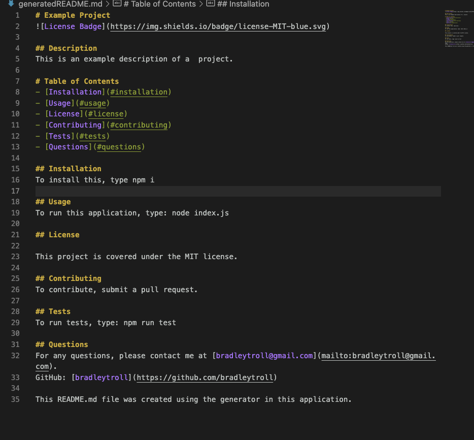

# README Generator

## Description
This README generator is a command-line application that dynamically generates a professional README.md file from a user's input using the Inquirer package. The purpose of this project is to make it easy for developers to generate a README.md file for their projects, including the usual sections generally included in a README.

# Table of Contents
- [Installation](#installation)
- [Usage](#usage)
- [License](#license)
- [Contributing](#contributing)
- [Tests](#tests)
- [Questions](#questions)

## Installation
To install, type the following in your terminal: npm i

## Usage
After installing the application, run it using the following command: node index.js

## License
This project is covered under the MIT license.

## Contributing
If you would like to contribute, please submit a pull request or contact me directly. 

## Tests
To run tests on the application, install and run the following: npm run test

## Questions
For any questions, please contact me at [bradleytroll@gmail.com](mailto:bradleytroll@gmail.com).
GitHub: [bradleytroll](https://github.com/bradleytroll)

## Video Demonstration
[Video Demonstration](https://drive.google.com/file/d/11uczQ5qchOzyEMh_8cCqRd1m6aqlATAg/view?usp=sharing)